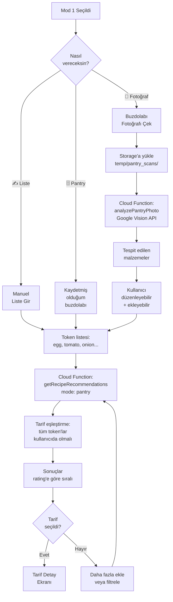
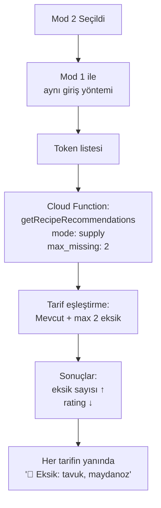
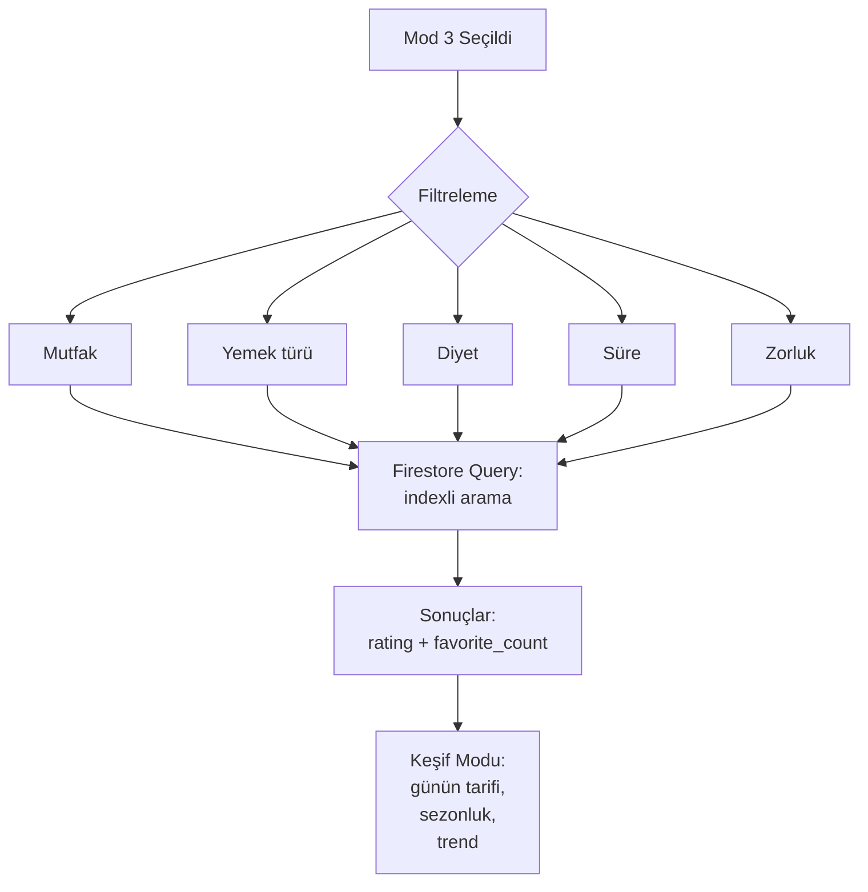

# 🎨 Pratik Tarifler — Faz 4: 3 Modlu UX Mimarisi

> **Açılışta kullanıcıya niyet sorulur, niyete göre tarif önerisi mantığı değişir.**

---

## 🎯 KULLANICI NİYETLERİ — 3 MOD

Kullanıcı app'i açtığında karşısına gelen ilk soru:

```
┌─────────────────────────────────────────────┐
│   🍳 Bugün ne pişirelim?                     │
├─────────────────────────────────────────────┤
│                                             │
│   🥘 EVDEKİ KALANLARLA YAPACAĞIM            │
│      Buzdolabı fotoğrafı veya liste         │
│      → MOD 1                                │
│                                             │
│   🛒 1-2 EK MALZEME ALABİLİRİM               │
│      Daha geniş seçenek                      │
│      → MOD 2                                │
│                                             │
│   🌍 SINIRSIZ KEŞFEDEYİM                     │
│      2500 tarif arası serbest                │
│      → MOD 3                                │
│                                             │
└─────────────────────────────────────────────┘
```

---

## 📊 MOD KARŞILAŞTIRMASI

| Özellik | Mod 1 (Pantry) | Mod 2 (Supply) | Mod 3 (Free) |
|---------|----------------|----------------|--------------|
| **Niyet** | Elimde ne varsa | 1-2 ek alabilirim | Sınırsız keşif |
| **Giriş** | Fotoğraf veya liste | Liste | Filtre/arama |
| **Eşleştirme** | SADECE elde olanlar | Max 2 eksik kabul | Tüm 2500 havuzu |
| **Sonuç sıralama** | Rating + kullanım % | Eksik sayısı ↑ | Rating + popülerlik |
| **AI kullanımı** | Vision (fotoğraf) | — | Suggestion |
| **Premium özellik** | Sınırsız scan | Geçmiş kayıt | Premium tarifler |

---

## 🔄 KULLANICI AKIŞI — DETAYLI

### MOD 1 — "Evdeki Kalanlarla" 🥘



### MOD 2 — "1-2 Ek Malzeme" 🛒



### MOD 3 — "Sınırsız Keşif" 🌍



---

## 🏗️ EKRAN YAPISI (Navigation Tree)

```
App Root
├── Auth Stack
│   ├── Welcome
│   ├── SignIn
│   └── SignUp
│
└── Main Tab Navigator (login sonrası)
    │
    ├── 🏠 Home Tab
    │   ├── ModeSelectionScreen ⭐ (ANA EKRAN — 3 mod kartı)
    │   │
    │   ├── Mode1 Stack ("Evdeki Kalanlarla")
    │   │   ├── PantryInputScreen (giriş seçimi: fotoğraf/liste/kayıtlı)
    │   │   ├── PhotoCameraScreen (fotoğraf çek)
    │   │   ├── PhotoReviewScreen (Vision sonucu inceleme)
    │   │   ├── IngredientListScreen (manuel liste/düzenleme)
    │   │   └── PantryResultsScreen (uygun tarifler)
    │   │
    │   ├── Mode2 Stack ("Hızlı Tedarik")
    │   │   ├── SupplyInputScreen (Mod 1 ile aynı giriş)
    │   │   └── SupplyResultsScreen (eksik malzeme listesiyle)
    │   │
    │   └── Mode3 Stack ("Sınırsız Keşfet")
    │       ├── DiscoverScreen (kategoriler, günün tarifi)
    │       ├── SearchScreen (filtreler + arama)
    │       └── BrowseScreen (sonsuz scroll)
    │
    ├── 🔍 Search Tab (genel arama, modsuz)
    │   └── SearchScreen
    │
    ├── ⭐ Favorites Tab
    │   ├── FavoritesScreen
    │   └── CollectionsScreen (kullanıcı koleksiyonları)
    │
    └── 👤 Profile Tab
        ├── ProfileScreen
        ├── SettingsScreen
        ├── PantryManagementScreen (Mod 1 için "kayıtlı buzdolabı")
        ├── SubscriptionScreen
        └── LanguageScreen

Modal Ekranlar (tüm tab'lardan açılabilir):
├── RecipeDetailScreen (tarif detayı)
├── CookModeScreen (adım adım pişirme modu)
└── RatingScreen (tarif puanlama)
```

---

## 🌐 API ENDPOINT TASARIMI

### Cloud Functions (Callable)
Tümü Firebase Functions üzerinden çağrılır.

#### 1. `analyzePantryPhoto` — Mod 1 fotoğraf
```typescript
// Request
{
  photo_path: "temp/pantry_scans/{uid}/{timestamp}.jpg",
  scan_id?: string  // tekrar denemek için
}

// Response (200)
{
  scan_id: string,
  detected_ingredients: [
    { token: "egg", confidence: 0.92, label_tr: "Yumurta" },
    { token: "tomato", confidence: 0.85, label_tr: "Domates" },
    { token: "onion", confidence: 0.78, label_tr: "Soğan" }
  ],
  raw_objects: [...],
  scan_count_today: 2,  // 3/gün free limit
  remaining_today: 1
}

// Error (429 — rate limit)
{
  code: "RATE_LIMIT",
  message: "Günde 3 scan hakkın doldu. Premium'a geç!"
}
```

#### 2. `getRecipeRecommendations` — Mod 1/2/3 tarif öneri
```typescript
// Request
{
  mode: "pantry" | "supply" | "discover",
  lang: "tr",
  ingredients?: string[],  // mod 1 & 2 için zorunlu
  filters?: {
    cuisine?: string,
    meal_type?: string,
    diet_tags?: string[],
    max_time_min?: number,
    difficulty?: "easy" | "medium" | "hard"
  },
  limit?: 20,
  cursor?: string  // pagination
}

// Response — Mod 1 (Pantry)
{
  mode: "pantry",
  total_matches: 8,
  recipes: [
    {
      id: "tr-menemen",
      title: "Menemen",
      description: "...",
      image: { url_thumb, blur_hash, ... },
      total_time_min: 15,
      difficulty: "easy",
      rating_avg: 4.8,
      // YENİ — Mod 1 özel:
      match_percentage: 100,
      uses_ingredients: ["egg", "tomato", "pepper", "onion"]
    }
  ],
  next_cursor: null
}

// Response — Mod 2 (Supply)
{
  mode: "supply",
  total_matches: 25,
  recipes: [
    {
      id: "tr-tavuk-sote",
      title: "Tavuk Sote",
      ...
      // YENİ — Mod 2 özel:
      missing_ingredients: [
        { token: "chicken", label_tr: "Tavuk göğüs", estimated_price_try: 35 }
      ],
      missing_count: 1
    }
  ]
}

// Response — Mod 3 (Discover)
{
  mode: "discover",
  total_matches: 1280,
  recipes: [...]  // klasik filter response
}
```

#### 3. `getPantryFromUser` — Kayıtlı buzdolabı
```typescript
// Request: GET
// Response
{
  pantry: [
    { token: "egg", display_name: "Yumurta", quantity: "6 adet", expires_at: "..." },
    ...
  ],
  last_updated_at: "..."
}
```

#### 4. `updatePantry` — Buzdolabı güncelle
```typescript
// Request
{
  action: "add" | "remove" | "set",
  items: [
    { token: "egg", quantity: "6 adet" }
  ]
}
```

#### 5. `incrementViewCount`, `toggleFavorite`, `submitRating`
Standart Firebase patterns.

---

## 📦 DOSYALAR YAPISI (Bu pakette üreteceklerim)

```
phase4_ux/
├── docs/
│   ├── UX_ARCHITECTURE.md (BU DOSYA)
│   ├── API_SPEC.md (detaylı endpoint spec)
│   └── WIREFRAMES.md (ASCII wireframe'ler)
│
├── screens/
│   ├── ModeSelectionScreen.tsx ⭐
│   ├── PantryInputScreen.tsx
│   ├── PhotoCameraScreen.tsx
│   ├── PhotoReviewScreen.tsx
│   ├── IngredientListScreen.tsx
│   ├── PantryResultsScreen.tsx
│   ├── SupplyResultsScreen.tsx
│   ├── DiscoverScreen.tsx
│   ├── SearchScreen.tsx
│   └── RecipeDetailScreen.tsx
│
├── components/
│   ├── ModeCard.tsx (büyük mod seçim kartı)
│   ├── IngredientChip.tsx (silinebilir token chip)
│   ├── RecipeCard.tsx (liste karti)
│   ├── RecipeCardPantry.tsx (Mod 1 — match% gösterir)
│   ├── RecipeCardSupply.tsx (Mod 2 — eksik malzeme)
│   ├── BlurImage.tsx (BlurHash → thumb → full progressive)
│   ├── IngredientPicker.tsx (modal — token seç)
│   └── EmptyState.tsx (sonuç yok)
│
├── api/
│   ├── client.ts (Firebase init + helpers)
│   ├── recipes.ts (recommendations, search)
│   ├── pantry.ts (analiz, get, set)
│   ├── user.ts (favorites, ratings)
│   └── types.ts (TypeScript)
│
├── hooks/
│   ├── useRecipeRecommendations.ts (Mod 1/2/3 hook)
│   ├── usePantryScan.ts (fotoğraf upload + Vision)
│   ├── useUserPantry.ts (buzdolabı yönetimi)
│   ├── useFavorites.ts
│   └── useDebounce.ts
│
├── types/
│   ├── recipe.ts
│   ├── user.ts
│   └── api.ts
│
└── i18n/
    ├── tr.json
    ├── en.json
    └── ... (12 dil)
```

---

## 🎨 TASARIM PRENSİPLERİ

### Visual
- **Tarif görselleri merkezde** — 4:3, BlurHash placeholder ile progressive load
- **Türk mutfak kültürü** — sıcak tonlar (terracotta, krem, koyu yeşil)
- **Açık & koyu tema** — sistem tercihini takip et
- **Tek el kullanımı** — önemli butonlar alt 1/3'te

### UX
- **3 ekran kuralı** — kullanıcı en fazla 3 tıkla tarife ulaşır
  1. Mod seç → 2. Malzeme gir/filtrele → 3. Tarif aç
- **Eyleme dönüştürülebilir geri bildirim** — boş sonuçta öneri ("Yumurta ekleyince 12 tarif daha açılır")
- **Niyet hatırlama** — son seçili mod default açılır
- **Onboarding minimal** — ilk girişte 1 ekran açıklama, geçilebilir

### Performance
- **Lazy loading** — tarif kartı görünene kadar full image yüklenmez
- **List virtualization** — `FlashList` ile binlerce tarif akıcı scroll
- **Offline-first** — favoriler ve son görülenler cache'te
- **Optimistic updates** — favori toggle hemen UI'da

### Accessibility
- **Screen reader** — tüm görsellere `accessibilityLabel`
- **Font size** — sistem ayarlarını takip et
- **Min touch target** — 44×44pt
- **Renk körlüğü** — sadece renge bağlı bilgi olmaz (icon + label kombosu)

---

## 🌍 LOKALİZASYON (RTL Desteği)

Arapça (`ar`) ve İbranice (`he`) için:
- React Native'in `I18nManager.forceRTL()` çağrısı
- Flex layout otomatik döner
- Icon yönleri `chevron-right` → `chevron-left` (manuel)
- Text alignment dile bağlı

---

## 🔒 PREMIUM FEATURE GATING

| Özellik | Free | Premium |
|---------|------|---------|
| Mod 1 fotoğraf scan | 3/gün | Sınırsız |
| Mod 2 (Supply) | Var | Var + alışveriş listesi export |
| Mod 3 (Discover) | Tüm tarifler | + Premium-only tarifler |
| Favoriler | 20 | Sınırsız |
| Geçmiş tarif | 7 gün | Sınırsız |
| Çoklu pantry profili | 1 | 5 |
| Reklam | Var | Yok |

Premium gate noktaları:
- Pantry scan limit dolunca → modal "Premium'a geç"
- Premium tarife tıklayınca → modal "Bu tarif Premium"
- Favori limit dolunca → modal

---

## 📊 ANALYTICS EVENTLERİ

```typescript
// Önemli olayları logla — Firebase Analytics
'mode_selected' { mode: 'pantry' | 'supply' | 'discover' }
'pantry_scan_started' { source: 'camera' | 'gallery' }
'pantry_scan_completed' { detected_count: 5, scan_time_ms: 2300 }
'ingredient_added' { token: 'egg', source: 'manual' | 'scan' }
'recipe_recommendation_shown' { mode, recipe_count, has_results: true }
'recipe_opened' { recipe_id, mode, position: 3 }
'recipe_cooked' { recipe_id }
'premium_gate_shown' { reason: 'scan_limit' | 'premium_recipe' }
'premium_upgrade' { source: 'gate' | 'profile' }
```

---

## 🎯 BAŞARI METRİKLERİ

| Metrik | Hedef |
|--------|-------|
| Mod seçimi → tarif açma oranı | %70+ |
| Mod 1 ortalama scan zamanı | <3 sn |
| Tarif önerisi → açılma oranı | %30+ |
| Favori ekleme oranı | %10+ kullanıcı |
| Premium dönüşüm | %3-5 |
| 7-gün retention | %25+ |

---

## 🚀 SONRAKİ ADIM

Bu mimari dokümanı sonrası **kod üretimi:**
1. ✅ Bu dokuman (mimari)
2. ⏭️ API spec detaylı (her endpoint'in tam tipi)
3. ⏭️ Wireframe'ler (ASCII art ile her ekran)
4. ⏭️ TypeScript types
5. ⏭️ Cloud Function implementasyonları
6. ⏭️ React Native ekranlar
7. ⏭️ Components
8. ⏭️ Custom hooks
